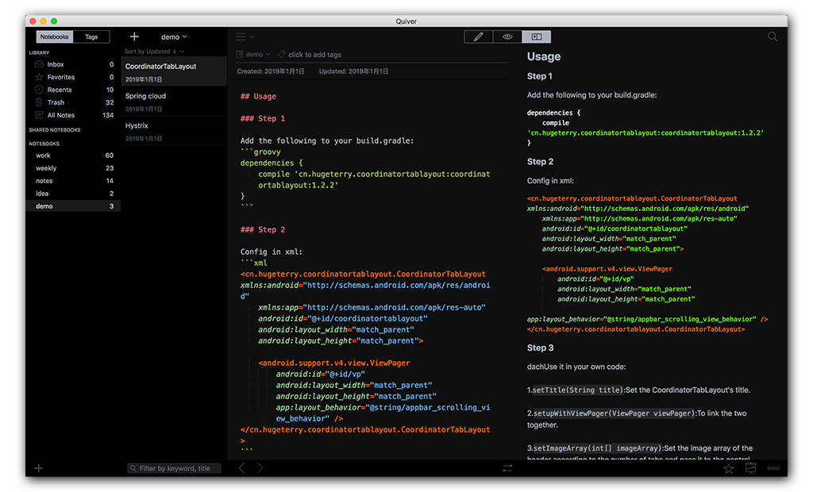

# QuiverSkin
Some [quiver](http://happenapps.com/) themes I created and used.

## Dark Ink
A theme named Dark Ink for Quiver Based on [One Dark](https://github.com/pslobo/Quiver-Theme-Atom-One-Dark)

**Screenshots**

## Chocolate
A theme named Chocolate for Quiver.

**Screenshots**

# Installation

1. Download [`blackink.json`](blackink.json) and [`chocolate.json`](chocolate.json)
2. Open Quiver
3. Preferences... 👉 Themes 👉 Load Theme...
4. Choose json file

# See also

- https://github.com/HappenApps/Quiver/wiki/Themes
- https://github.com/HappenApps/Quiver/wiki/How-to-Design-a-Custom-Theme